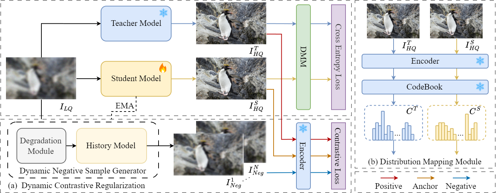
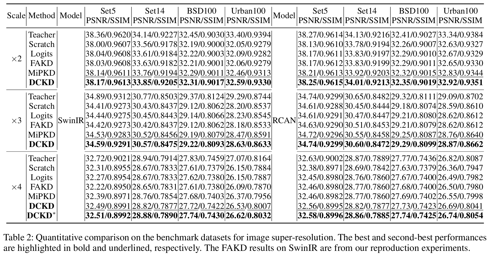
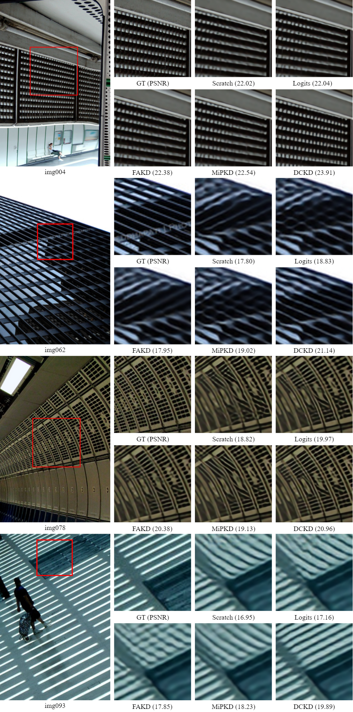

# Enhancing Lightweight IRSR Models via Knowledge Distillation with Structural and Spectral Losses
<div>
    Seungsoo Han<sup>1,*</sup>&emsp;
    Dongnyeok Choi<sup>1,</sup>&emsp;
    Deukhwa Kim<sup>1</sup>&emsp;
    Jeonghun Kim<sup>1</sup>&emsp;
    Seunghoon Shin<sup>1</sup>&emsp;
</div>
<div>
    <sup>1</sup>Funzin Co.LTD.
</div>

[[Paper]](https://ictc.org/program_proceeding)

The code is based on [DCKD](https://github.com/super-SSS/DCKD)

> **Abstract:** 
For Infrared Image Super-Resolution (IRSR) technology, maintaining performance while reducing model complexity is critical for a wide range of applications. However, existing research on lightweight IRSR has been predominantly limited to modifying model architectures. This study proposes a new methodology that applies Knowledge Distillation, a representative model compression technique from supervised learning, to IRSR models. To this end, we extend the DCKD framework, previously used for RGB image super-resolution, to the IRSR domain and introduce new loss functions designed to maximize the preservation of key structural characteristics in infrared images, namely edge and spectral(Contourlet-domain) information. Through the proposed methodology, a lightweight student model trained with distilled knowledge from a high-performance, complex teacher model consistently achieved superior performance compared to the same architecture trained via standard supervised learning. This study demonstrates that Knowledge Distillation based methodology is effective for developing lightweight IRSR models and is expected to contribute to fields where high-efficiency IRSR is essential, such as real-time military surveillance, disaster response, and nocturnal reconnaissance.



## News

- [2025.11] Training codes is released.
- [2025.09] 🚩Accepted by ICTC2025.

---
# DCKD

## Preparation

### Install

1. Create a new conda environment
```
conda create -n dckd python=3.8
conda activate dckd
```

2. Install dependencies
```
conda install pytorch==1.10.0 torchvision==0.11.0 torchaudio==0.10.0 cudatoolkit=11.3 -c pytorch
pip install -r requirements.txt
python setup.py develop
```

### Download

VQGAN model **checkpoints** can be downloaded from

[https://github.com/CompVis/taming-transformers](https://heibox.uni-heidelberg.de/d/8088892a516d4e3baf92/)

Teacher model **checkpoints** can be downloaded from

- SwinIR: [https://github.com/JingyunLiang/SwinIR/releases](https://github.com/JingyunLiang/SwinIR/releases)
  - 001_classicalSR_DIV2K_s48w8_SwinIR-M_x2.pth
  - 001_classicalSR_DIV2K_s48w8_SwinIR-M_x3.pth
  - 001_classicalSR_DIV2K_s48w8_SwinIR-M_x4.pth

## Train

Run the following script to train the model:

```sh
python -m torch.distributed.launch --nproc_per_node=4 --master_port=4321 basicsr/train.py -opt options/train/SwinIR/train_SwinIR_SRx2_DCKD.yml --launcher pytorch
```

More training configs can be found in `./options`. 

## Test

Run the following script to test the trained model:

```sh
python basicsr/test.py -opt options/test/SwinIR/test_SwinIR.yml
```

## Results

<details>
<summary>Quantitative Comparisons (click to expand)</summary>

<p align="center">
  
</p>
</details>

<details>
<summary>Visual Comparisons (click to expand)</summary>

<p align="center">
  
</p>
</details>

## Citation

If you find this work useful for your research, please cite our paper:

```bibtex
@article{zhou2024dynamic,
  title={Dynamic Contrastive Knowledge Distillation for Efficient Image Restoration},
  author={Zhou, Yunshuai and Qiao, Junbo and Liao, Jincheng and Li, Wei and Li, Simiao and Xie, Jiao and Shen, Yunhang and Hu, Jie and Lin, Shaohui},
  journal={arXiv preprint arXiv:2412.08939},
  year={2024}
}
```
